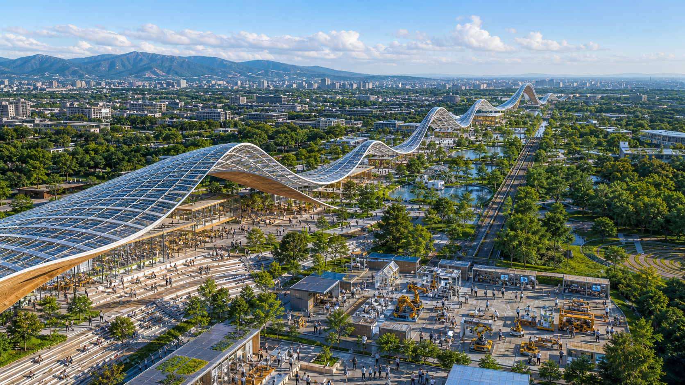
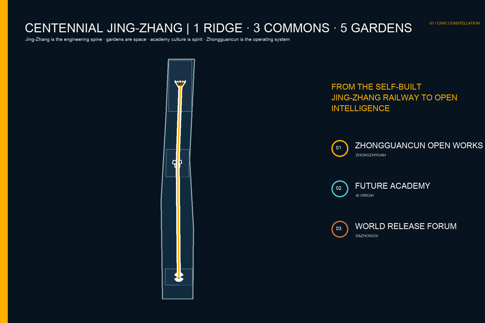
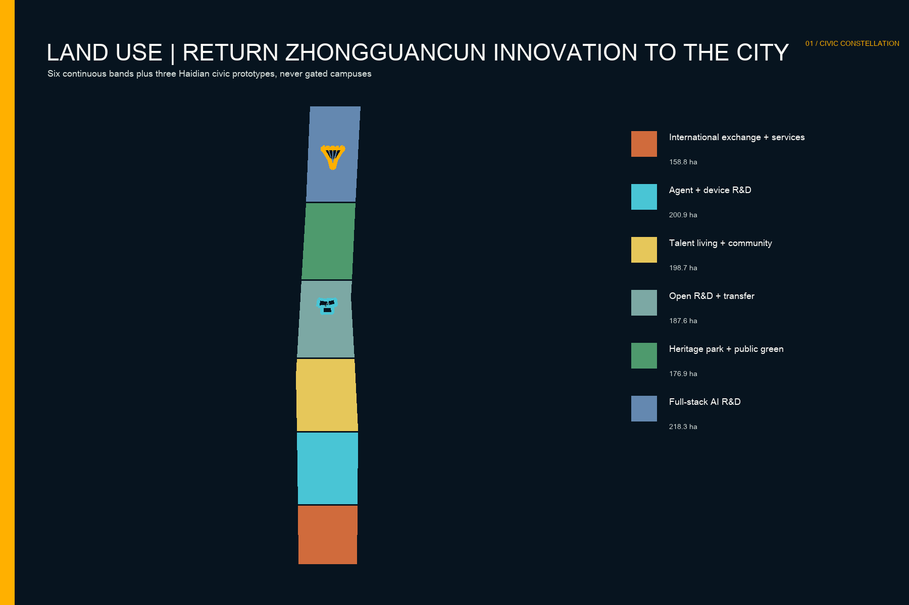
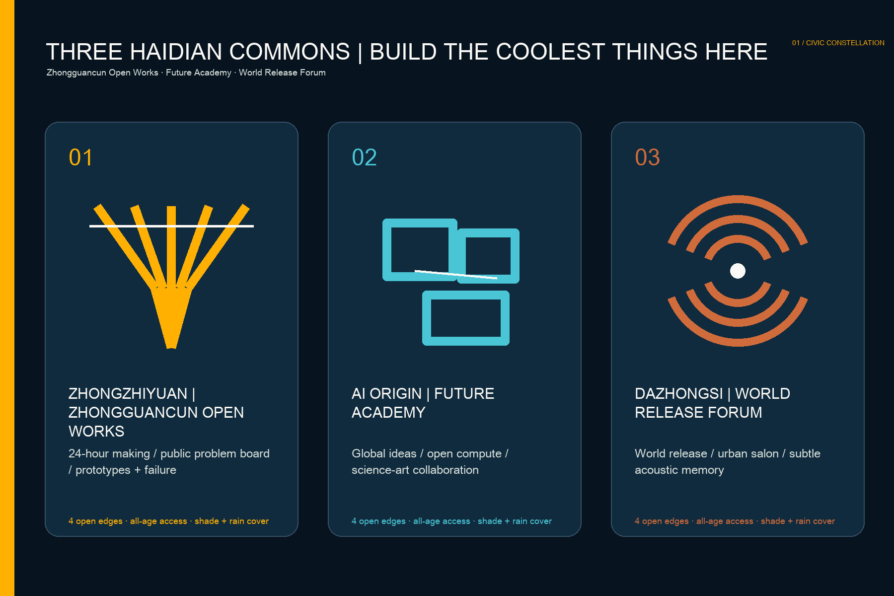
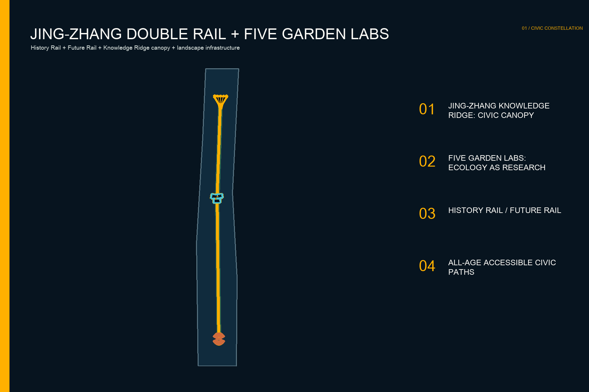
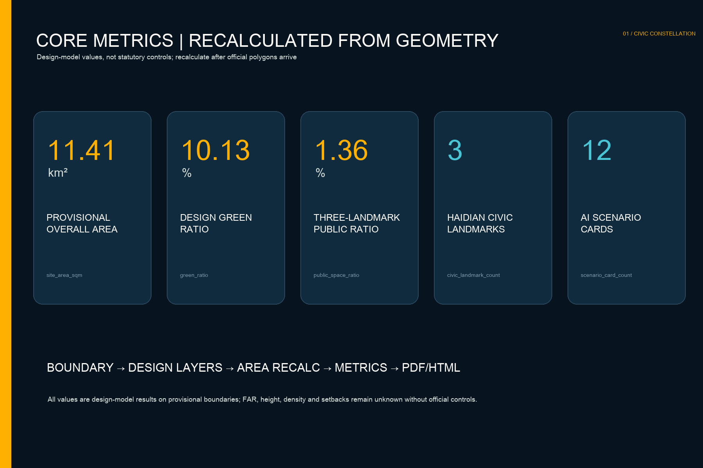

# THE CIVIC CONSTELLATION / 京张文明星座

> **FROM HAIDIAN CIVILISATION TO INTELLIGENCE COMMONS. 从海淀文明，到智能共同体。** From the self-built Jing-Zhang Railway to a future created in common. This is not another technology park. It is the place where the world's most inventive people choose Haidian to confront hard questions, build audacious things and release valuable knowledge in public.

## Design Basis and Source List

The proposal begins with the three official working scales, three key areas and five functions in the public announcement. It does not disguise missing public data as certainty. The overall design uses the site package's provisional rough polygon, calculated at approximately 11.41 square kilometres. Zhongzhiyuan, AI Origin and Dazhongsi also use provisional polygons. They support concept generation and spatial review only; they are not statutory redlines, parcel edges or approvals. All nine geometry layers, metrics and drawings must be recalculated when official polygons arrive. [source:OFFICIAL-ANNOUNCEMENT] [data:geometry/site_boundary.geojson#SITE-001]

The evidence chain includes the announcement, agent taskbook, site package, source registry and professional standards. The taskbook introduces open collaboration, scenario cards, personas, pilgrimage landmarks, identity and long-term operation. The source registry distinguishes official, background and provisional material. Regulatory planning, ownership, road redlines, utilities, fire, flood and heritage controls remain unavailable, so FAR, height, density and setbacks stay unknown rather than becoming invented precision. [source:AGENT-TASKBOOK] [standard:MOHURD-URBAN-DESIGN-MEASURES]

The daylight hero is original generated concept art showing the Knowledge Ridge, Future Academy, open making and Five Garden Labs in active public use. It is neither an existing-site photograph nor a promise of an exact built result. The five planning figures are generated from this package's GeoJSON and metrics. Rights and permitted uses are documented in the copyright statement and `sources.json`. [source:IMAGEGEN-CIVIC-HERO]

Local culture is not applied decoration; it is the generative system. **Centennial Jing-Zhang is the engineering spine:** surveying, standards, gradient, switches, chainage and continuous maintenance become spatial order. **The Three Mountains and Five Gardens are the spatial DNA:** mountain, water, garden, framed views and seasonal time become future ecological infrastructure. **Haidian academy culture is the intellectual core:** open debate, truth-seeking, interdisciplinarity and public education become civic institutions. **Zhongguancun innovation is the operating system:** respect for science, inclusion, first moves and repeated attempts govern daily life. Dazhongsi remains a restrained but meaningful acoustic and knowledge-marker layer in the south. [source:JINGZHANG-HERITAGE-PARK] [source:HAIDIAN-GARDEN-WATER] [source:ZHONGGUANCUN-CULTURE]

## Three-Level Scope Framework

The coordinated research scale asks why global innovators must choose Haidian: Centennial Jing-Zhang connects the Three Mountains and Five Gardens, universities and institutes, and Zhongguancun into one culture capable of generating the new. At overall scale, the double rail rises into the low but monumental Jing-Zhang Knowledge Ridge, joining photovoltaic civic canopy, open academy, public laboratories, Five Garden Labs and all-weather movement. The key-area scale identifies the first places where people come to do audacious work: Zhongguancun Open Works, Future Academy and World Release Forum. [depth:three_level_scope_framework]

“Centennial Jing-Zhang: One Ridge, Three Commons, Five Gardens” is a testable spatial system, not an invented redline. Two parallel public lines become the History Rail and Future Rail; one hundred conceptual chainage markers use the rhythm of sleepers to register engineering, Zhongguancun innovation and civic contributions. The Jing-Zhang Knowledge Ridge rises with five research gardens, while the three Commons remain distinct, ticket-free and pass-through. [data:geometry/roads.geojson#ROAD-001]

Jing-Zhang is not treated as a passive relic but as an enduring engineering method. Survey, standardise, branch, test and maintain become five design rules: chainage coordinates the belt; double rails separate memory from future; switches generate open-making branches; demountable canopy segments enable incremental construction; and public maintenance logs keep the system useful. Existing station, rail, switch and locomotive heritage should be conserved under professional heritage requirements; new work neither imitates history nor covers authentic fabric. [source:JINGZHANG-HERITAGE-PARK]

The layer logic is explicit. Land-use polygons fully partition the provisional boundary. Three Commons, Five Gardens, Jing-Zhang double rails and segmented Knowledge Ridge canopy are thematic overlays. Pavilions and canopy footprints are prototypes, not approved buildings. Three phase polygons express testing order rather than funding or construction promises. Readers can trace each claim into data, metrics, bilingual drawings and the offline visual page. [metric:civic_landmark_count]

## Coordinated Research Area: Industry and Future City Research

The Civic Constellation recasts a world-class AI ecosystem as a city without academic walls. Source research encounters real problems; radical ideas collide in public; open-source contribution earns civic reputation; prototypes are made quickly; and mature firms collaborate with city and global partners while residents gain value without becoming raw data. The scarce infrastructure is a commons where truth-seeking, argument, making, failure, review and release become visible urban life. [source:AGENT-TASKBOOK] [source:ZHONGGUANCUN-CULTURE]

One-north, 22@, Kendall Square, Otaniemi, Salford Rise and Old Oak offer methods rather than forms to copy: mixed ecosystems, heritage renewal, active ground floors, experimental nature, community stitching and shared opportunity. Haidian wins not by resembling them but through a cultural stack they cannot reproduce: garden civilisation gives ecology historical depth; academy culture subjects innovation to long intellectual testing; Zhongguancun moves ideas rapidly into prototypes and markets; Jing-Zhang anchors the future in autonomous engineering. [source:CASE-ONE-NORTH] [source:CASE-22BARCELONA]

The promise to global talent is not luxurious office space; it is the ability to accomplish something today that was previously impossible. Debate across disciplines in Future Academy in the morning, connect ecological data to models in the Garden Labs at noon, fabricate a robot in Open Works in the afternoon, then publish results and limits to the world at night. The same place supports walking, care, solitude and anonymous opt-out. AI enters only when public value is explicit and a staffed, non-digital route remains. [source:CASE-OTANIEMI]

## Overall Design Area: Urban Renewal and Regulatory-Plan-Level Urban Design

The overall structure combines six continuous land-use bands with Centennial Jing-Zhang, One Ridge, Three Commons and Five Gardens. The south forms a transit-linked World Release Forum; AI Origin becomes Future Academy; Zhongzhiyuan becomes 24-hour Zhongguancun Open Works. Five research gardens occupy the intervals, while the Jing-Zhang Knowledge Ridge canopy turns the historic engineering axis into one continuous public institution. The bands remain reproducible functional models, not a statutory land-use amendment. [data:geometry/land_use.geojson#LU-001]

Renewal follows “open first, experiment second, make permanent last.” Fences, parking and inactive ground floors are softened; reversible canopy fragments, tables, power, compute, shade and accessible ramps then run as a one-year public test. Only after ownership, regulatory, transport and utility conditions are verified would buildings be retained, adapted, replaced or added. Pavilion and canopy footprints test scale only; storeys, heights and total floor area remain undetermined. [depth:retain_renovate_demolish]

Regulatory-plan-level responsibility is carried by machine-readable evidence: complete land-use coverage; building footprints; centre lines; green and public space; an honest empty constraint layer; phasing; and reproducible metrics. Unknown controls remain visibly unknown. This provides a spatially serious proposition without crossing the boundary of professional planning, engineering or approval. [standard:MOHURD-CONTROL-DETAILED-PLANNING]

## Detailed Design of Key Areas

**Zhongguancun Open Works, Zhongzhiyuan.** Jing-Zhang switch logic becomes parallel test branches: 24-hour workshops, robot and device fields, open-compute interfaces, material library, public red teams, repair café and a citywide Real Problem Board. Teams publish unfinished work and failures so institutes, firms and residents can iterate together. It turns Zhongguancun's culture of first attempts, revision and renewed effort into urban landscape rather than trade-show display. [data:geometry/public_space.geojson#PUBLIC-001]

**Future Academy, AI Origin.** The intellectual heart is formed by three interpenetrating contemporary courts, stepped forums, transparent research halls, public libraries and open compute, accessible around the clock to researchers, students, founders, artists, families and neighbours. What it inherits from Haidian academy culture is not roof style but truth-seeking, argument, interdisciplinarity and public education. Institute research is explained, challenged, translated and opened here. [data:geometry/public_space.geojson#PUBLIC-002]

**World Release Forum, Dazhongsi area.** The southern civic ground handles transit arrival, international demonstrations, device experience, media and urban night life: knowledge made in the first two commons is released to the world here. Dazhongsi is not a theme form; it survives only as a subtle acoustic field and knowledge scale in the paving and public-speaking environment. Each launch must reveal limits, energy, risk and human responsibility; commercial events may never close the commons. [data:geometry/public_space.geojson#PUBLIC-003]

The Jing-Zhang Knowledge Ridge creates an instantly recognisable image without becoming an empty icon. Its continuity comes from the railway; five crests echo mountain and garden; translucent photovoltaics, demountable metal lattice and warm timber form a future material family. The three commons remain radically different: make, inquire, release. Their contribution systems record reusable prototypes, open knowledge and international collaboration through public rules and human review, never facial recognition, credential prestige or purchasing power. [depth:three_key_area_detailed_design]

## AI Innovation Ecosystem, Personas, and AI+ Scenarios

Five primary personas test the place. Global researchers need short-term access, quiet focus and trusted peers. Open-source maintainers need public credit, collaboration tables and durable archives. Startups need affordable trials, legal and compute interfaces, and permission to show failure. Residents need daily movement, shade, family life and freedom from tracking. Disabled and older users need continuous ramps, tactile information, human assistance and digital opt-out. A sixth persona, the frontline city worker, checks whether maintenance, cleaning, safety and device operation are genuinely designed. [standard:ACCESSIBILITY-LAW-PRC]

Twelve scenario cards share the same audience-location-data-review-exit structure: 01 Haidian Real Problem Board; 02 72-hour build sprint; 03 Centennial Jing-Zhang Engineering Open Class; 04 Future Academy Ideas Night; 05 Five Gardens climate and ecology co-test; 06 public open-compute bench; 07 public red-team day; 08 institute transfer clinic; 09 global youth residency; 10 accessibility gap co-test; 11 public class on failure; and 12 Jing-Zhang × Zhongguancun Open Futures Week. Participation never requires an account, and staffed or anonymous routes remain available. [source:AGENT-TASKBOOK]

Three industry pilots come first. An Autonomous Systems City Challenge tests energy, latency, safety and repairability in Open Works. Ideas-to-Public-Service translates institute work into small explainable services at Future Academy. A World Release Protocol requires limits, risk, energy and appeal routes with every launch. Success is cross-team reuse, real problems resolved, accessible completion, disturbance response and quality of human takeover, not raw footfall. [standard:GENAI-INTERIM-MEASURES]

AI governance follows data minimisation. Facial recognition is off by default, personal movement is not built for advertising, and opaque scores do not allocate public resources. Sensors collect aggregates only where necessary and declare purpose, retention and responsibility. Navigation, event safety and maintenance suggestions must be explainable, switchable and human-reviewed. Paper signs, staffed desks and device-free routes remain permanent. [depth:ai_scenarios_governance]

## Land Use, Building Scale, and Retain-Renovate-Demolish Strategy

The six land-use bands are a functional model: international exchange and services; agent and device R&D; talent living and community support; open R&D and technology transfer; heritage park and public green; and full-stack autonomous innovation. Each band is clipped to the provisional boundary and recalculated. Official codes, mixed-use shares and development intensity require future regulatory and ownership information. [standard:MNR-LAND-USE-CLASSIFICATION-GUIDE]

The building proposition is “retain first, touch the ground lightly, open the ground floor, adapt for low carbon.” No potentially valuable building is removed before survey, assessment and ownership verification. Typical buildings first gain open ground floors, shared roofs, shading and flexible interiors. The Knowledge Ridge is not a sealed megastructure: sixteen independently buildable, maintainable and replaceable canopy segments rise five times into one silhouette, sheltering low zones and framing views above. Geometry is conceptual only; height, FAR, density, floor area and setbacks remain unknown. [metric:building_footprint_area_sqm]

Every retain-renovate-demolish decision requires a seven-part audit: cultural value, structural safety, embodied carbon, utilisation, public contribution, ownership and engineering cost. Classic identity must not be purchased through unnecessary demolition. It emerges from precise juxtaposition of railway traces, mature trees, campus and research fabric with the Knowledge Ridge. [depth:height_massing_character]

## Transport, Rail, Municipal Infrastructure, and Public Services

Movement priority is walking and wheelchairs, cycling, public-transport interchange, necessary service access and finally private cars. Two parallel public routes run the full belt: the History Rail carries Jing-Zhang engineering memory; the Future Rail carries open knowledge, cycling and daily service. Each commons has accessible paths. Connections to Wudaokou, Qinghua Donglu Xikou, Dazhongsi and Fifth Ring crossings require official road and rail data. Submitted lines are conceptual, not redlines. [data:geometry/roads.geojson#ROAD-001]

The three commons and Ridge share a public-service base: water, toilets, storage, care and quiet rooms, repair, weather cover, first aid, staffed information and publicly reservable workbenches. A digital layer provides multilingual navigation, crowd notices, accessible routes and events, but every service has a non-digital equivalent. Large events use booking and time slots so the park never becomes a mobility bottleneck. [depth:traffic_rail_slow_parking]

Municipal strategy is reversible, measurable and maintainable. Canopies and pavilions reserve power, network and edge-compute interfaces. The Five Gardens combine stormwater, microclimate, habitat and genuine research; translucent photovoltaics first serve public light, ventilation and low-energy devices. Utility, capacity, drainage, flood, fire and rail conditions remain missing. The package proposes interfaces, never engineering feasibility. [depth:municipal_new_infrastructure]

## Blue-Green Network, Public Space, and Urban Character

Green is how the civilisation of the Three Mountains and Five Gardens works in the future. A conceptual 72-metre corridor links five research landscapes: Climate Garden tests shade and thermal comfort; Robotic Ecology studies machines with habitat; Life Garden combines science literacy and biodiversity; Compute Garden makes energy and water legible; Imagination Garden hosts art-science experiments. Mountain, water, tree, rock, framed view and season become infrastructure, not historic scenery. The 10.13% design ratio is not a statutory control. [metric:green_ratio]

The 1.36% public-space ratio counts only the three Commons and avoids double-counting park land. Each remains four-sided and open, with continuous accessible routes, varied seating, shade, water, tactile information and quiet edges. Planting, water and subtle level changes separate action from restoration without fences. [metric:public_space_ratio]

Urban character combines the rise of a ridge, the layering of gardens, the openness of an academy and Zhongguancun's capacity to change. Silver lattice, translucent photovoltaics, pale timber, mineral stone and retained brick form a maintainable future palette. Amber marks open interfaces rather than screens. The identity is one fine ridge rising five times through three open commons: a new Haidian skyline from afar and a civic roof anyone can use up close. [depth:blue_green_public_space]

## Renewal Projects, Implementation Policy, and Phasing

Near-term projects JZ-C01 to C05 comprise a full-scale Open Works fragment, Five Garden pilots, double-rail continuity audit, accessibility co-testing and public-service base. Mid-term projects C06 to C10 build Future Academy's first phase and segmented Ridge canopy while opening inactive ground floors, rebalancing parking and stitching movement. Long-term projects C11 to C14 address World Release Forum, the complete canopy, transit integration and civic stewardship. [data:geometry/phasing.geojson#PHASE-001]

An advisory “Haidian Future Academy Council” would bring residents, universities and institutes, open-source communities, firms, artists, operators and accessibility representatives to one table. Annual budgets, event occupation, data use and recognition would be public. Sponsorship may support common services but cannot buy segment naming, closure rights or personal data. Government, landowners and legal professionals must refine the model. [depth:phasing_implementation]

JING-ZHANG × ZHONGGUANCUN OPEN FUTURES turns the centennial engineering axis into a world academy: public making in the north, science-art-intellectual debate in the centre, live city experiments in the Gardens and world release in the south. It must leave reusable prototypes, open documentation and an improvement list rather than photographs alone. Long-term performance is judged by open hours, mixed use, reused outputs, resident satisfaction and maintenance. [source:CASE-SALFORD-RISE]

## Metrics, Area Recalculation, and Compliance Matrix

Core metrics are recalculated in EPSG:4548 from GeoJSON: 11.413 square kilometres of provisional area, a 10.13% design green ratio, a 1.36% three-Commons public-space ratio, three Haidian civic landmarks and twelve scenario cards. Building footprint includes conceptual pavilions and segmented canopy only; it cannot produce total floor area or FAR. Values, formulas, files, confidence and assumptions are explicit in `metrics.json`. [metric:site_area_sqm]

The compliance matrix covers official tasks 1.3, 1.4 and 1.5 plus agent.1 through agent.6, linking chapters, geometry, metrics, drawings, sources and checks. The standard matrix distinguishes mandatory, optional and professionally pending controls. The depth matrix covers overall structure, three detailed areas, land use, buildings, transport, utilities, public space, renewal, phasing, recalculation and risk. Any content edit requires fresh manifest hashes and a new four-gate self-check. [depth:metrics_recalculation]

Performance does not reduce to “more is better.” Suggested future measures include free open hours, device-free route completion, shared use across age and ability, cross-team prototype reuse, resolution time for resident disturbance, successful human takeover, shade coverage and storm recovery. Baselines must come from operating pilots; the submission does not fabricate results. [source:SOURCE-REGISTRY]

## Risk, Copyright, and Compliance

The primary risk is missing boundary and professional control data. Provisional key-area rectangles cannot support approvals or precise development decisions. Regulatory, ownership, road, rail, utility, fire, flood, heritage and existing-building information must trigger full review. A second risk is commercial or event occupation displacing everyday use, addressed through four open sides, free basic services, commercial occupation limits and quiet hours. A third risk is AI surveillance, addressed through minimum data, non-identification, short retention, human review and an equivalent exit route. [data:geometry/constraints.geojson#CONSTRAINTS]

The hero was generated by an OpenAI image tool from an original project prompt. It is concept art without third-party photographs, brands or identifiable people and is not site evidence. Planning figures, pages and layouts are generated from this proposal's original code and data. System fonts are used for rendering but are not distributed. International cases are cited for public methods only; their images and design expressions are not copied. [source:IMAGEGEN-CIVIC-HERO]

The submission does not claim government approval, adopted planning, owner consent or guaranteed construction. Dimensions, operating mechanisms and phases are conceptual references for professional development. Urban agents do not replace statutory planning, public decision-making, engineering safety or accountable human judgement. [assumption:A-CONTROLS-001]

## References

Project sources include the Haidian public announcement, repository site package, agent taskbook, source registry and bilingual terminology guide. Professional references cover urban-design administration, regulatory detailed planning, territorial land-use classification, accessibility and generative-AI governance. The full machine index is in `sources.json`, `standard_matrix.json` and `design_depth_matrix.json`. [source:SITE-PACKAGE]

Case research uses first-party institutional pages: JTC on one-north and LaunchPad; Barcelona City Council on 22@ renewal; MIT on Kendall Square's housing, laboratories, active ground floors and open space; Aalto on Otaniemi's forest, art, testing and accessibility; Salford City Council on a public connection across a road barrier; and London City Hall on Old Oak's public realm and locally shared opportunity. They are strategic references, not formal copies. [source:CASE-KENDALL] [source:CASE-OLD-OAK]

Geometry and metric evidence live in `geometry/` and `metrics.json`. Paired Chinese and English proposals, HTML reports, five bilingual figure sets, A3 booklets, A0 boards and offline visual pages provide equivalent reading routes. Every generated file is registered in the manifest and checked for hashes, spatial validity, visual packaging and professional evidence. [source:SOURCE-REGISTRY]
