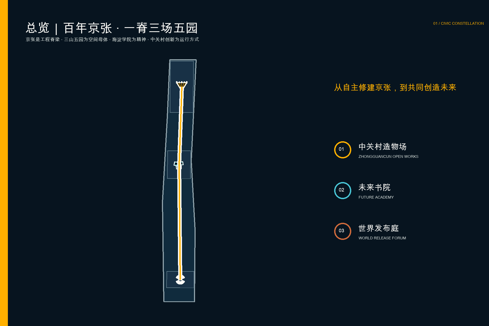
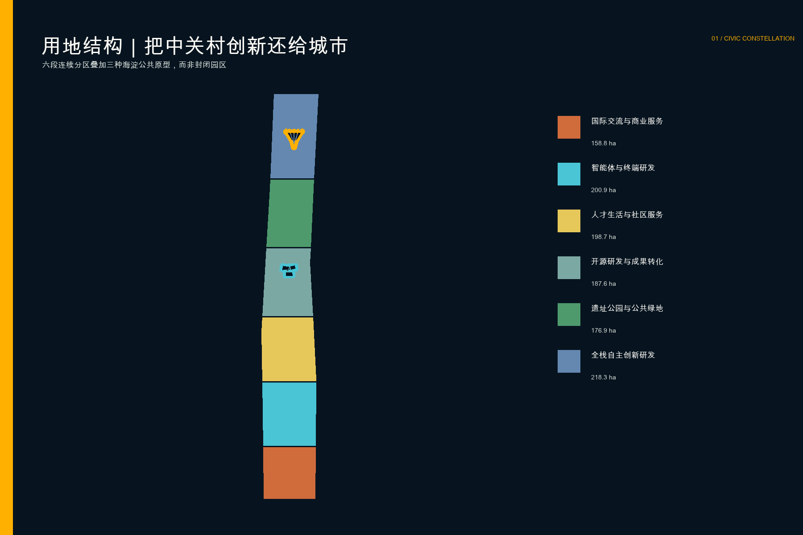
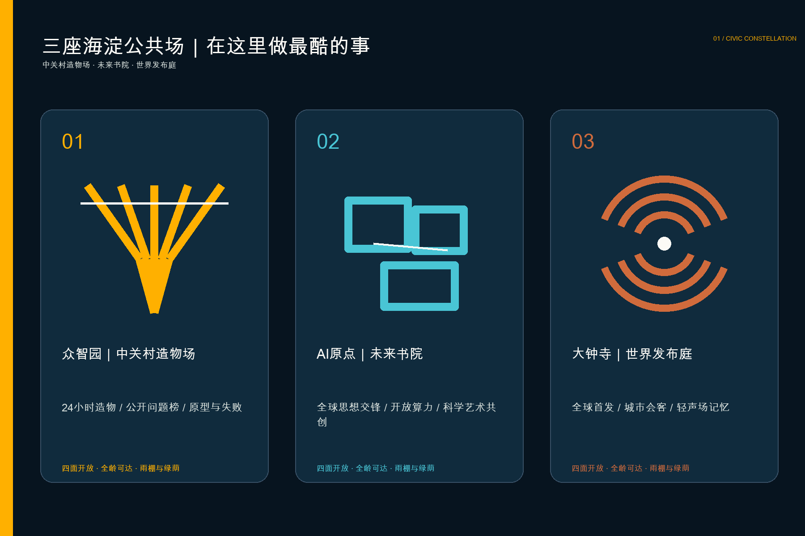
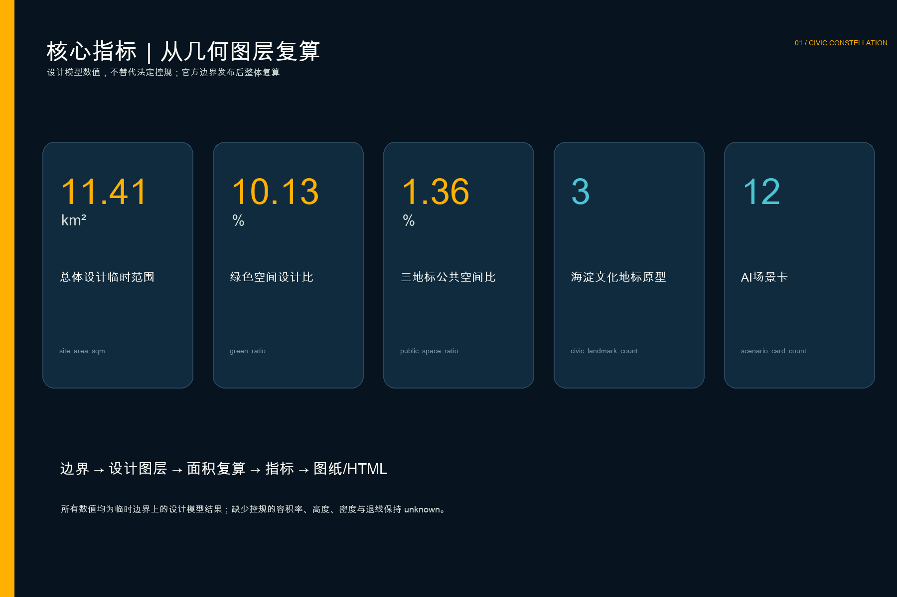

# 京张文明星座 / THE CIVIC CONSTELLATION

> **FROM HAIDIAN CIVILISATION TO INTELLIGENCE COMMONS. 从海淀文明，到智能共同体。** 从自主修建京张，到共同创造未来。这里不是复制另一座科技园，而是让全世界最有创造力的人愿意来海淀，一起研究最难的问题、制造最酷的东西、公开最有价值的知识。

## 设计依据与资料清单

方案首先服从公告确定的三层范围、三处重点区域和五类功能，不把公开资料缺口包装成“已知”。总体设计暂沿用场地包的临时粗略边界，计算面积约 11.41 平方公里；众智园、AI原点和大钟寺同样使用 provisional polygons。它们只用于概念生成、空间复核和参赛表达，不是法定红线、道路边界或审批依据。正式边界到位后，九类几何图层、全部面积和图纸必须整体复算。[source:OFFICIAL-ANNOUNCEMENT] [data:geometry/site_boundary.geojson#SITE-001]

依据链由公告、agent 任务书、场地包、来源登记表和现行专业标准组成。公告提供任务与面积量级；任务书提出开放协作、场景卡、人才画像、朝圣地标、品牌与长期运营要求；场地包区分 official、background 与 provisional；标准矩阵则约束用地分类、城市设计深度、无障碍、生成式AI和人工复核。控规、权属、道路红线、管线、消防、防洪和文保控制缺失，因此容积率、高度、密度、退线均维持 unknown，不用设计者猜测值制造确定性。[source:AGENT-TASKBOOK] [standard:MOHURD-URBAN-DESIGN-MEASURES]

主视觉为本次原创生成的白天概念图，画面中的京张双轨不是背景线，而是贯穿知识山脊、未来书院、公开造物和五园实验的空间主轴。图片不作为现状照片或精确效果承诺；五张规划图来自本包 GeoJSON 与 metrics 自动绘制。授权边界详见版权声明与 `sources.json`。[source:IMAGEGEN-CIVIC-HERO]

地方文化不是贴在建筑表面的纹样，而是方案的生成规则。**百年京张是工程脊梁**：自主勘测、标准、坡度、道岔、里程和持续维护被转译为空间秩序。**三山五园是空间母体**：山、水、园、借景和时序成为未来生态基础设施。**海淀学院文化是精神核心**：开放讨论、求真、跨学科和公共教育成为核心制度。**中关村创新文化是运行方式**：崇尚科学、创新包容、敢为人先、允许失败再出发。大钟寺则在南端留下克制但有分量的声场与知识刻度。[source:JINGZHANG-HERITAGE-PARK] [source:HAIDIAN-GARDEN-WATER] [source:ZHONGGUANCUN-CULTURE]

## 三层范围工作框架

统筹研究范围回答“为什么全球创新者非来海淀不可”：百年京张连接着三山五园、高校院所和中关村，工程、园林、思想与创新共同构成一套能产生新事物的文化生态。总体设计范围回答“怎样让这种生态拥有世界级形象”：让京张双轨向上生长为一条低伏却壮阔的“京张知识山脊”，把透明光伏天幕、公共书院、开放实验室、五座未来园林实验室与全天候慢行连成整体。重点区域回答“哪三个地方先让人想来做酷事”：众智园中关村造物场、AI原点未来书院、大钟寺世界发布庭。[depth:three_level_scope_framework]

“百年京张 · 一脊三场五园”不是虚构红线，而是可复核的空间系统。两条平行公共线分别成为“历史轨”和“未来轨”；沿线100组概念里程标以枕木节奏记录京张工程、中关村创新与公共贡献。京张知识山脊随五座园林实验室起伏；三场形态各异、四面开放、无门票、可穿越；五园则把气候、机器生态、生命科学、开放算力与想象力变成研究型景观。[data:geometry/roads.geojson#ROAD-001]

京张不是被动保存的一件遗物，而是一种持续有效的工程方法。方案把“勘测—定标—分岔—试验—维护”转译为五条设计规则：以里程建立全带坐标，以双轨区分记忆与未来，以道岔生成开放制造支线，以可拆天幕允许逐段建设，以公开维护日志保证长期可用。既有老站、旧轨、道岔和机车等遗产应按专业文保要求保留展示；新增部分不伪装成历史，也不覆盖真实遗存。[source:JINGZHANG-HERITAGE-PARK]

图层关系保持清楚：用地分区完整覆盖临时总体边界；三场、五园、京张双轨和知识山脊天幕作为专题叠加；低层开放亭廊与分段天幕只是空间原型，不代表批准建筑；三期范围表达试点顺序，不暗示资金或建设承诺。评审者可以从正文追到图层、指标、A3/A0 和离线网页。[metric:civic_landmark_count]

## 统筹研究范围产业与未来城市研究

文明星座把“世界级AI生态”解释为一所没有围墙的城市书院。源头研究能遇见真实问题，最激进的思想能公开碰撞，开源贡献能获得公共声誉，初创产品能在造物场快速验证，成熟企业能在世界发布庭与城市和全球伙伴协作，居民分享创新价值却不被当作数据原料。最稀缺的基础设施不是另一座封闭办公楼，而是把求真、争论、制造、失败、复盘和发布变成可见公共生活的城市共同体。[source:AGENT-TASKBOOK] [source:ZHONGGUANCUN-CULTURE]

六个国际案例提供方法而非造型复制：one-north、22@、Kendall Square、Otaniemi、Salford Rise 与 Old Oak 分别证明混合生态、遗产更新、活跃首层、自然实验、社区缝合和共享机会的重要性。海淀不以“更像它们”取胜，而以它们无法复制的文化叠层超越：三山五园让生态具有文明深度，学院文化让创新接受长期思想检验，中关村让思想迅速进入原型与市场，京张让新未来扎在自主工程的时间轴上。[source:CASE-ONE-NORTH] [source:CASE-22BARCELONA]

面向全球人才的承诺不是豪华办公，而是“今天就能做成一件以前做不成的事”：上午在未来书院与不同学科争论，中午在五园实验室把生态数据接入模型，下午在造物场完成机器人原型，晚上在世界发布庭公开成果和局限。这里也能散步、照顾家庭、独处恢复和匿名退出。AI 只在公共价值明确时进入空间，并保留无手机、无识别、有人值守的等价路径。[source:CASE-OTANIEMI]

## 总体设计范围城市更新与控规深度城市设计

总体结构为六段连续用地带叠加“百年京张 · 一脊三场五园”。南部结合轨道到达形成世界发布庭与国际协作；中段以AI原点未来书院连接高校、科研院所、企业和市民；北部众智园形成全天候中关村造物场；五座未来园林实验室穿插其间，京张知识山脊天幕把历史工程轴转化为连续公共机构。分区严格裁切于临时边界且无重叠，只作为可复算功能模型，不构成法定用地调整。[data:geometry/land_use.geojson#LU-001]

更新方法坚持“先开放、再实验、后固化”。第一步柔化围栏、停车场和消极首层，形成可穿越界面；第二步用轻量天幕、共享桌、供电与算力接口、绿荫和无障碍坡道运行一年真实试验；第三步才在权属、控规、交通和市政条件确认后，以保留、改造、置换或新建形成长期空间。提交中的亭廊与知识山脊分段基底只用于尺度验证，层数、高度和总建筑规模保持待定。[depth:retain_renovate_demolish]

控规深度的责任通过结构化文件体现：用地完整覆盖、建筑基底、道路中心线、绿地、公共空间、约束空集、分期与指标均可机读；不能确认的开发强度、红线和设施标准明确为 unknown。这样既给出足够深的空间主张，又不越过专业规划和工程审查边界。[standard:MOHURD-CONTROL-DETAILED-PLANNING]

## 重点区域详细设计

**中关村造物场 / Zhongguancun Open Works，众智园。** 京张道岔的分岔逻辑被转译为多条并行试验支线：24小时共享工坊、机器人与智能终端测试场、开放算力接口、材料库、安全红队、维修咖啡馆和面向全城的“真实问题榜”。任何团队都能公开半成品与失败记录，跨院所、企业和居民共同迭代；空间不是展销会，而是把中关村“先试、再改、再出发”变成城市景观。[data:geometry/public_space.geojson#PUBLIC-001]

**未来书院 / Future Academy，AI原点。** 这是全案精神中心：由三组相互穿透的当代院落、阶梯论坛、透明研究厅、公共图书与开放算力组成，24小时向研究者、学生、创业者、艺术家、家庭与邻里开放。它继承海淀学院文化的不是屋顶样式，而是求真、争论、跨学科和公共教育；院所成果在这里被解释、质疑、转译和开源，最前沿的思想不躲在围墙之后。[data:geometry/public_space.geojson#PUBLIC-002]

**世界发布庭 / World Release Forum，大钟寺片区。** 南端承担轨道到达、国际路演、智能终端体验、媒体发布与城市夜生活，是前两处产生的新知识第一次面向世界公开的地方。大钟寺文化不作为主题造型，只在铺地知识刻度、克制的同心声场和多语公共演讲的声学设计中留下轻微回响。每次发布必须同步展示局限、能耗、风险和人工责任，商业活动不得封闭整个公共场。[data:geometry/public_space.geojson#PUBLIC-003]

京张知识山脊构成一眼可识别的城市图像，却不是一次性形象工程。它的连续性来自铁路，五次起伏回应三山五园的山水节奏，半透明光伏、可拆金属格构与温润木构形成未来材料谱系；下方三场完全不同：造、研、发。永久贡献系统分别记录可复用原型、公开知识和跨国协作，依据公开规则与人工审核，不以人脸识别、学历名望或消费能力排序。[depth:three_key_area_detailed_design]

## AI 创新生态、人才画像与 AI+ 场景

五类核心人物决定空间是否成立：全球研究者需要短期接入、安静专注和可信同行；开源维护者需要公开声誉、协作桌与长期档案；初创团队需要低成本试验、法务算力接口和失败展示权；周边居民需要日常通勤、绿荫、亲子与不被追踪；无障碍使用者和长者需要连续坡道、清晰触觉信息、人工帮助与数字退出。第六类“城市一线工作者”作为校验者，确保维护、保洁、安全和设备运营被纳入设计而非隐藏。[standard:ACCESSIBILITY-LAW-PRC]

十二张场景卡以“对象—地点—数据—人工复核—退出机制”组织：01 海淀真实问题榜；02 72小时造物冲刺；03 京张百年工程公开课；04 未来书院思想夜；05 五园气候与生态共测；06 公共开放算力台；07 安全红队开放日；08 院所成果转化门诊；09 全球青年驻留；10 无障碍断点共测；11 失败公开课；12 京张·中关村开放未来周。每个场景都允许人工窗口或匿名参与，不把公共空间访问与注册账号绑定。[source:AGENT-TASKBOOK]

三项产业验证优先试行。A“无人系统城市挑战”在造物场测试能耗、延迟、安全与可维修性；B“思想到公共服务”在未来书院把院所成果转译为可解释的小型城市服务；C“世界首发协议”要求发布庭的每个产品同步公开局限、风险、能耗与申诉入口。成功标准不是人流越多越好，而是跨团队复用率、真问题解决率、无障碍完成率、居民扰动投诉和人工接管质量。[standard:GENAI-INTERIM-MEASURES]

AI治理采用最小数据原则：默认不做人脸识别，不为广告建立个人轨迹，不用黑箱评分决定公共资源。传感器只在必要时采集聚合数据，标明目的、保存期和责任主体；导航、活动安全和设施维护建议必须可解释、可关闭、可人工复核。空间中始终保留纸质导视、人工服务台与无设备路线。[depth:ai_scenarios_governance]

## 用地、建筑规模与拆改留方案

六段用地分区是功能结构模型：国际交流与商业服务、智能体与终端研发、人才生活与社区服务、开源研发与成果转化、遗址公园与公共绿地、全栈自主创新研发。每段由临时边界切割并复算面积，用来检查南北角色和公共资源是否连续；正式用地代码、混合比例与开发强度须由后续控规和权属资料确认。[standard:MNR-LAND-USE-CLASSIFICATION-GUIDE]

建筑采取“保留优先、轻触地面、开放首层、低碳适配”的设计建议。现状价值建筑在完成测绘、鉴定和权属核验前不做拆除结论；一般建筑优先通过首层打开、屋顶共享、立面遮阳和可变内部更新。新增“知识山脊”不是封闭巨构，而是16个可独立建设、维护和拆换的轻质公共天幕段，五次起伏形成统一轮廓，低处遮雨，高处框景并容纳自然通风与半透明光伏。几何只表达概念基底，建筑高度、容积率、密度、总规模和退线保持 unknown。[metric:building_footprint_area_sqm]

拆改留清单以单栋审计为前置：文化价值、结构安全、碳排、使用率、公共贡献、权属和工程代价七项同时评估。任何“经典”都不能靠不必要拆除获得；真正的辨识度来自旧铁路、成熟树木、校园与科研街区肌理同知识山脊的精确并置。[depth:height_massing_character]

## 交通、轨道、市政与公共服务设施

交通优先级依次为步行与轮椅、骑行、公共交通接驳、必要服务车辆、机动车。两条平行公共线贯穿全带：“历史轨”保存京张工程记忆，“未来轨”组织开放知识、骑行和日常服务；三座公共场各有无障碍游线。与五道口、清华东路西口、大钟寺站及跨五环节点的关系须在正式道路和轨道资料到位后校核。线路为概念中心线，不代表道路红线。[data:geometry/roads.geojson#ROAD-001]

三场和知识山脊设置同一组公共服务底盘：饮水、厕所、储物、母婴与安静室、维修点、雨棚、遮阳、急救、人工咨询以及可公开预约的工作台。数字层提供多语导视、拥挤提醒、无障碍路径和活动信息，但所有服务都有非数字等价入口。大型活动使用预约与分时机制，不把公园变成交通瓶颈。[depth:traffic_rail_slow_parking]

市政策略采用可逆、可监测、可维护原则：天幕和亭廊预留电力、网络与端侧算力接口；五园同时承担雨洪滞蓄、微气候、生境与真实科研；半透明光伏优先服务公共照明、通风和低能耗设备。管线、供电容量、排水、防洪、消防与轨道保护条件均属缺失资料，当前只表达接口原则，不宣称工程可实施性。[depth:municipal_new_infrastructure]

## 蓝绿空间、公共空间与城市风貌

绿地不是建筑之间的剩余，而是三山五园文明在未来的工作方式。约72米宽的概念绿廊串联五座研究型园林：气候园测试遮荫与热舒适，机器生态园研究机器人与生境共处，生命园连接公共科普与生物多样性，算力园公开能源与水耗，想象园容纳艺术科学实验。山、水、树、石、借景和四季变化被转译为生态基础设施，而不是仿古布景。绿地设计比为 10.13%，不替代法定绿地率。[metric:green_ratio]

公共空间比 1.36% 只计算三座公共场的设计面积，刻意不把所有公园绿地重复计入。每处四面开放，设置连续无障碍路线、不同高度座椅、遮荫、饮水、可触知信息和安静边缘；活动与休息通过植物、水和高差温和分隔，避免用围栏制造“公共空间”。[metric:public_space_ratio]

城市风貌以“山脊的起伏、园林的层叠、书院的开放、中关村的可变”为母题。银白轻质格构、半透明光伏、浅木、矿物石材与保留砖墙形成可维护的未来材料谱系；琥珀色只标记开放接口，不把城市变成屏幕。标志是一条五次起伏的细脊穿过三个开放场，远看是海淀新天际线，近看是一座人人能用的公共屋檐。[depth:blue_green_public_space]

## 更新项目清单、实施政策与分期计划

近期项目 JZ-C01 至 C05 包括造物场1:1样段、五园实验原型、双轨连续性审计、无障碍共测和公共服务底盘，以轻量可逆设施验证真实需求。中期项目 C06 至 C10 建设未来书院首期和知识山脊分段天幕，打开消极首层、重平衡停车、缝合慢行。长期项目 C11 至 C14 才涉及世界发布庭、完整天幕、轨道一体化和公共信托机制。[data:geometry/phasing.geojson#PHASE-001]

运营上建议建立“海淀未来书院理事会”作为多方协作参考模型：居民、高校与科研院所、开源社区、企业、艺术家、运营与无障碍代表共同制定使用规则；年度预算、活动占用、数据使用和贡献荣誉均公开。商业赞助可支持公共运营，但不能购买整段命名权、排他使用权或用户数据。该机制需政府、产权方和专业法律团队深化，不是既定实施安排。[depth:phasing_implementation]

年度品牌事件“JING-ZHANG × ZHONGGUANCUN OPEN FUTURES / 京张·中关村开放未来周”让百年工程轴成为一所世界书院：北部公开制造，中部展开思想、科学与艺术辩论，五园发布城市实验，南部面向世界首发。活动结束后必须留下可复用原型、开源文档和改善清单，而不是只留下传播照片。长期绩效以日常开放小时、跨群体共用、复用成果、居民满意与维护质量衡量。[source:CASE-SALFORD-RISE]

## 指标体系、面积复算与合规矩阵

核心指标由 EPSG:4548 下的 GeoJSON 复算：总体临时边界面积 11.413 平方公里，绿色空间设计比 10.13%，三场公共空间比 1.36%，海淀公共地标原型3处，场景卡12张。建筑基底指标包含概念亭廊与分段天幕，不能推导总建筑面积或容积率。指标、公式、来源文件、置信度与假设均记录在 `metrics.json`。[metric:site_area_sqm]

合规矩阵逐条覆盖公告 1.3、1.4、1.5 与 agent.1-agent.6，并把章节、图层、指标、图纸、来源和自检连接起来。标准矩阵区分 mandatory、optional 与待专业确认；设计深度矩阵覆盖总体结构、三处重点、用地、建筑、交通、市政、公共空间、更新、分期、复算和风险。任何图文更新后都必须重新生成 manifest 哈希并运行四道自检。[depth:metrics_recalculation]

指标不以“越大越好”误导设计。新增绩效建议包括：全天免费开放时长、无设备路径完成率、不同年龄与能力群体共同使用率、原型跨团队复用率、居民扰动投诉解决时间、人工接管成功率、树荫覆盖与暴雨恢复时间。它们需在运营试点中建立基线，不在当前提交中编造结果。[source:SOURCE-REGISTRY]

## 风险、版权与合规说明

首要风险是边界和专业条件缺失：临时矩形重点区不能用于审批或精确建设决策；控规、权属、道路、轨道、市政、消防、防洪、文保与现状建筑资料到位后，所有空间结论必须复核。第二类风险是知识山脊沦为空洞形象或公共场被商业活动挤占，因此天幕必须分段、可维护、以公共功能为先，三场四面开放、基本服务免费并设商业占用上限和安静时段。第三类风险是AI监测侵入公共生活，因此默认最小数据、非识别、短保存、人工复核和等价退出路径。[data:geometry/constraints.geojson#CONSTRAINTS]

主视觉由 OpenAI 图像生成工具根据本方案原创提示生成，是概念艺术，不含第三方照片、品牌、人物身份或现状证据；规划图、网页和版面由本次提交的代码与数据原创生成。系统字体仅用于渲染，不随包分发。国际案例只提炼公开方法并链接原始来源，不复制其图像或设计表达。许可与用途详见 `report/copyright_statement.md`。[source:IMAGEGEN-CIVIC-HERO]

本方案不声称获得政府批准、规划审定、产权同意或建设承诺。空间尺寸、运营机制和项目阶段均为概念建议或可供专业团队深化的参考方案；城市智能体不替代规划审批、公共决策、工程安全或人工责任。[assumption:A-CONTROLS-001]

## 参考资料

项目依据包括海淀分局发布的征集公告、仓库场地包、agent 任务书、来源登记与赛事术语表；法定与专业参考包括城市设计管理、控规、国土空间用地分类、无障碍与生成式AI治理相关文件。完整机器索引见 `sources.json`、`standard_matrix.json` 与 `design_depth_matrix.json`。[source:SITE-PACKAGE]

案例研究均使用机构一手页面：JTC one-north 的研发教育生活混合与 LaunchPad；Barcelona 市政府 22@ 的工业区更新、知识产业与绿色设施；MIT Kendall Square 的住房、实验室、活跃首层和开放空间；Aalto Otaniemi 的森林校园、艺术、实验与全龄可达；Salford 市政府的跨路公共连接；London City Hall 的 Old Oak 公共空间与本地共享机会。案例是策略参照，不是形式模仿。[source:CASE-KENDALL] [source:CASE-OLD-OAK]

几何与指标证据分别保存在 `geometry/` 与 `metrics.json`；中文/英文提案、HTML、五组双语图件、A3 文册、A0 展板和离线视觉页形成一一对应的阅读路径。所有生成物均在 manifest 中登记并接受哈希、自检、空间、视觉与专业证据校验。[source:SOURCE-REGISTRY]
